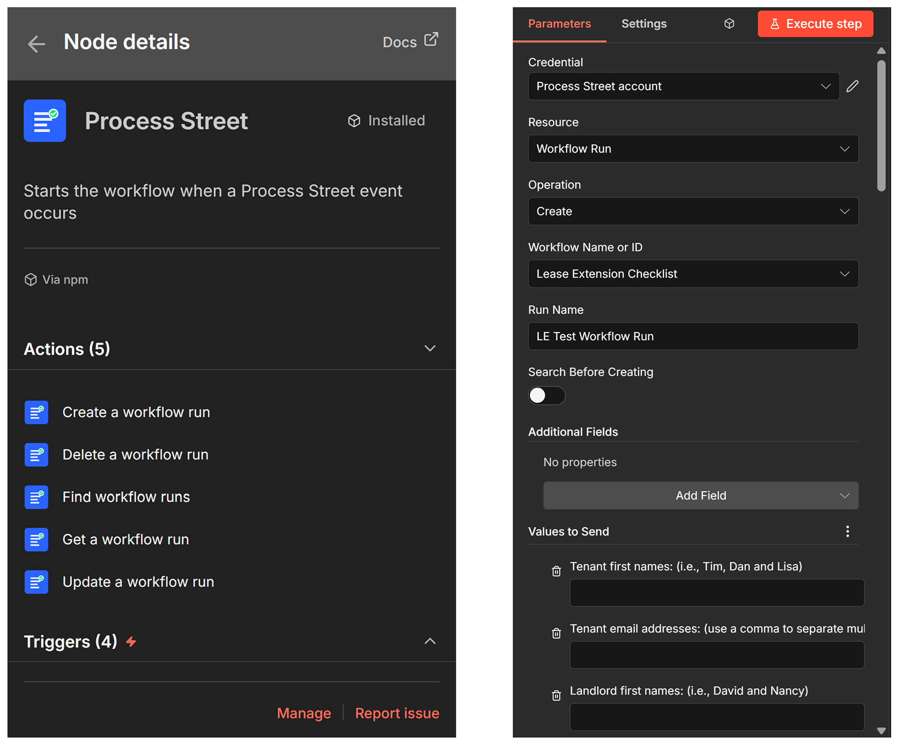
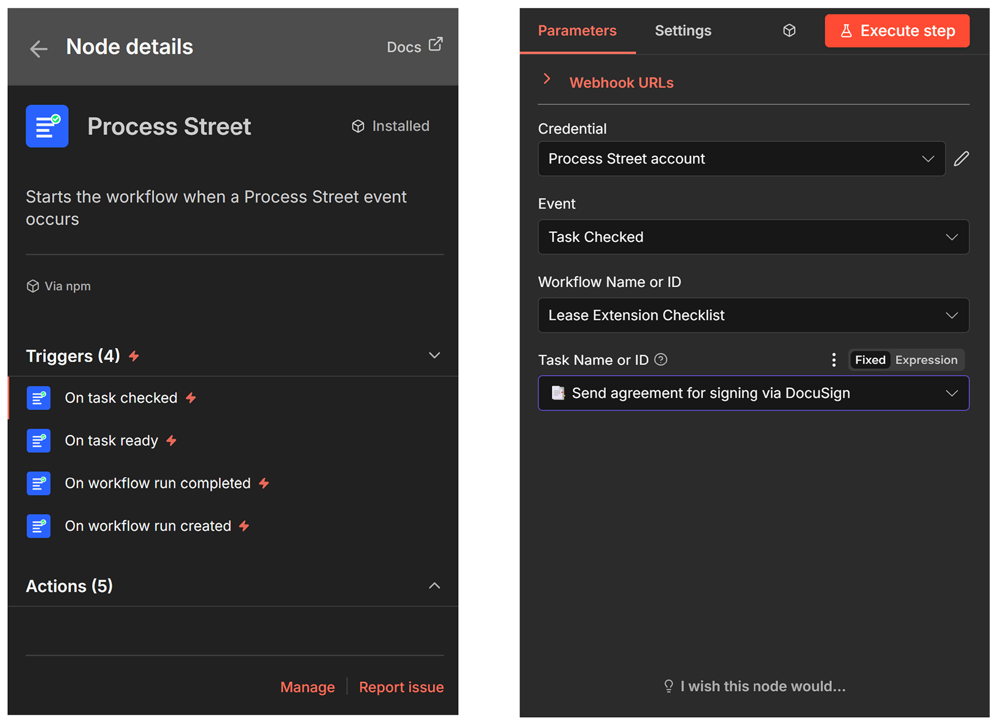

# n8n-nodes-process-street

This is an n8n community node for [Process Street](https://www.process.st/) — a workflow automation platform for recurring checklists and processes.

[n8n](https://n8n.io/) is a fair-code licensed workflow automation platform.

## Installation

Follow the [installation guide](https://docs.n8n.io/integrations/community-nodes/installation/) in the n8n community nodes documentation.

> On native Windows, see [Troubleshooting](#troubleshooting) if the Community Nodes dialog fails to install the package.

## Credentials

You need a Process Street API Key to use this node:

1. Log in to your Process Street account
2. Go to **Settings > API Keys**
3. Create a new API key
4. Copy the key and use it when creating Process Street credentials in n8n

## Operations



### Workflow Run

| Operation | Description |
|-----------|-------------|
| Create | Create a new workflow run (optionally search for existing first) |
| Delete | Delete a workflow run |
| Find | Search for workflow runs by name, status, or workflow |
| Get | Get a workflow run by ID |
| Update | Update a workflow run's name, status, due date, or sharing |

Form fields for the selected workflow load dynamically via a resource mapper, and MultiSelect options appear as native checkboxes.

## Triggers



### Process Street Trigger (Webhook)

Real-time triggers powered by Process Street webhooks:

- **Task Checked** — when a task is checked off
- **Task Ready** — when a task is ready to be worked on
- **Workflow Run Completed** — when a workflow run is completed
- **Workflow Run Created** — when a new workflow run is created

> **Note on testing triggers:** Process Street's webhook API rejects n8n's ephemeral `/webhook-test/...` URLs, so the "Listen for test event" button does not register a webhook. To receive events, **activate the workflow** in n8n — that exposes the production `/webhook/...` URL, which Process Street accepts.

#### Complete form fields on every event

Process Street's webhook payloads only include the form fields for the section that fired the event (for example, **Task Checked** sends just the checked task's fields under `data.formFields`). To save you a follow-up API call, the trigger automatically fetches the **entire** workflow run's form fields and adds two properties to each event:

- **`allFormFields`** — every field on the run, in the Process Street API's raw shape (the value is nested under `data.value`, the type is under `fieldType`).
- **`flatFields`** — the same fields simplified to `{ fieldType, label, value }` for easy access, so you can do `{{ $json.flatFields.find(f => f.label === 'Market rent:').value }}` without digging into nested objects.

The original `data.formFields` is left untouched. If the lookup fails for any reason, the event is still delivered with an `allFormFieldsError` message instead of being dropped.

## Known Limitations

- **Comment triggers** (New Comment, New Comment Attachment) are not supported because the Process Street v1.1 API does not expose comment endpoints or webhook triggers for comments.
- The **Update Workflow Run** operation fetches the current state before updating because the Process Street API requires all fields on PUT requests.
- **Due Date** on Create and Update must be at least 24 hours in the future. The Process Street API rejects near-future dates with a generic 400 error, so the node validates client-side and returns a clear message instead. If you're entering a local time, use a Luxon expression (example is provided in the Due Date field description) to produce a correctly-offset ISO 8601 string.

## Compatibility

- Requires n8n version 1.0.0 or later
- Uses n8n Nodes API version 1

## Troubleshooting

Most users install this package through n8n's **Settings → Community Nodes** dialog on Linux, macOS, n8n Cloud, or Docker without issue. The two known gotchas are both native-Windows-specific:

### `spawn npm ENOENT` when installing from the Community Nodes dialog

n8n on native Windows can fail to locate `npm` (it's `npm.cmd`, which Node's `spawn` won't auto-resolve without `shell: true`). This is an n8n-on-Windows limitation, not a problem with this package. Workaround — install manually into n8n's user nodes directory:

```bash
cd %USERPROFILE%\.n8n\nodes
npm install n8n-nodes-process-street --omit=peer --ignore-scripts
```

Then restart n8n.

### `node-gyp` / Python errors about `isolated-vm` during install

`isolated-vm` is a native module pulled in transitively via `n8n-workflow`. It ships prebuilt binaries for Node LTS versions (20, 22). If you're on a non-LTS Node (e.g. 25), the prebuild lookup misses and npm falls back to compiling from source, which requires Python and a C++ toolchain.

The `--ignore-scripts` flag above avoids the compile entirely. n8n resolves `n8n-workflow` from its own install at runtime, so you don't need a working copy in the user nodes directory. Switching to Node 22 LTS also fixes it permanently.

## Resources

- [Process Street API Documentation](https://www.process.st/help/docs/process-street-api)
- [n8n Community Nodes Documentation](https://docs.n8n.io/integrations/community-nodes/)

## License

[MIT](LICENSE)
